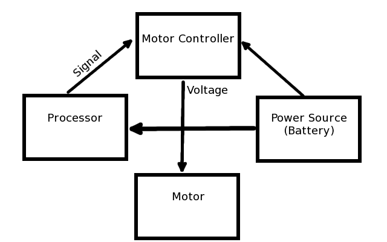

Let's step back a little bit and look at the practical elements of robots.

Robots are generally controlled like this:

The input influences the behaviour of the actual robot. Input can encompass a lot of different sources, but the important factor is that control is dependant on it.

# Program
There are two main kinds of programming possible of robots. The first is known as an embedded micro-controller. This is a physical device that has the instructions to run *built into it*. There is no way to change this behaviour. This type of programming is popular in single-goal robots.

The second, more popular way to program robots is a downloading / deploying system. In this system, the programmer writes programs on a separate computer, and downloads the program onto the robot using some kind of connection (wifi, ethernet, etc.).

# Electronics
A key element of robot control is the electronics. Electronics provides input and output. The input is typically sensors or electronic clocks. The output is typically motor voltage or solenoid signals. There are usually internal systems in a robot's electronics that regulate signals and voltages. Things like speed controllers help modularize components.

You can see that the motor is controlled through voltage, which is regulated through a speed controller. It would be very unwise to let the processor directly send voltage to motors, because it is a very valuable part not meant to handle that kind of voltage.
